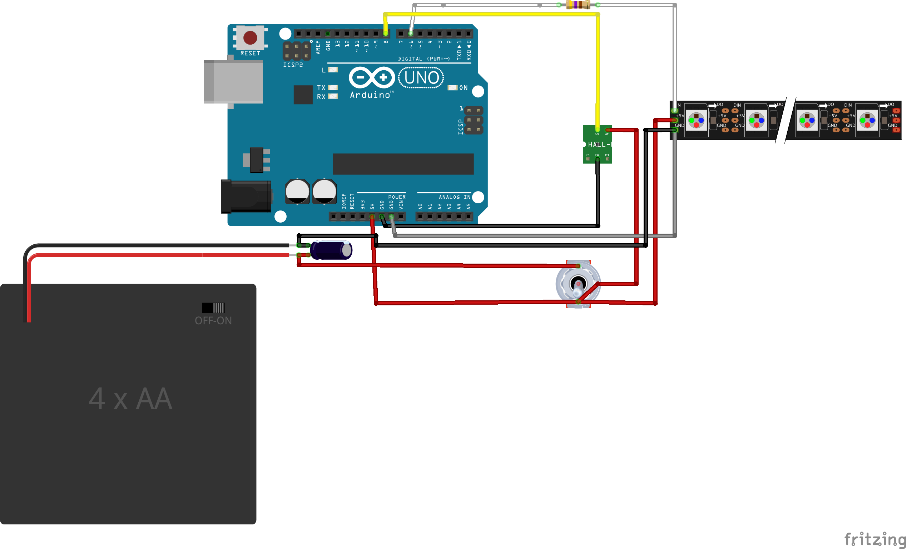

## Speed-sensitive bike lights

This is a fun project I did to create side-mounted lights for my bike that would react to different speeds.
The basic idea is a LED light strip that goes up the downtube, around the headtube, and back down again, secured with adhesive velcro strips, a hall sensor chip and magnet to detect the speed of the wheel, and a microcontroller + power supply inside a water bottle to coordinate the whole thing.
I also wanted to be able to easily detach the whole system from my bike, in about 5 minutes or less. Sometimes I lock up the bike outside, or ride it in poor weather, and I didn't want the thing to get stolen or destroyed. So, the light strip and sensor are secured with velcro, and easy to detach from the microcontroller and power supply. It doesn't really fit easily into a backpack without risk of damage, though.

## Parts

- 1 Ardunio Uno
- 1 4AA battery holder (https://www.amazon.com/LAMPVPATH-Battery-Connector-Plastic-Housing/dp/B01MAXT00Q/)
- 4 rechargable AA batteries. Note: The rechargable part is important! Alkaline batteries will have a higher voltage. 4AA rechargable is ~4.8V, close enough to 5V to power the whole system without issue. 4AA alkaline is ~6V, above the safe voltage for the light strip.
- 1 toggle switch (https://www.adafruit.com/product/3308)
- 1 hall sensor chip (https://www.amazon.com/SunFounder-Switch-Sensor-Arduino-Raspberry/dp/B013G5N03O/)
- 1 spoke magnet (https://www.amazon.com/CatEye-Universal-Wheel-Magnet/dp/B018RZ23AE/)
- 1 470-ohm resistor
- 1 large capacitor (TODO: what size was it?)
- 1 Neopixel light strip, 60 pixels per strip (https://www.adafruit.com/product/1461?length=1)
- 2 4-wire waterproof cables (https://www.adafruit.com/product/744)
- 1 mid-size water bottle storage container (or even just a water bottle). Main limiting factor here is whether the Arduino can fit through the mouth of the bottle. I used the WBS Unit from Profile Design, it was just barely big enough to fit everything (https://www.amazon.com/Profile-Designs-Water-Bottle-Storage/dp/B01E6EZNW0/).
- Adhesive velcro strips, and some velcro ties
- Some sticky pads for wall hangings (relevant for padding the sensor if you need to get it closer to the wheel)
- Lots of colored hook up wire, shrink wrap, superglue, etc.

## Wiring Diagram

## How to make it

1. First, I wired up and got the whole system working without trying to put anything other than the light strip on the bike. Only after I was satisfied that the code/hardware actually worked, did I think about how it was going to get attached.
2. Then, I took the water bottle storage container and drilled 3 holes - one just above where the cage would end for the toggle switch, and two in the bottom of the container (for cables for the light strip and the hall sensor).
3. Then, I broke out the soldering iron and started with where the 4 wire cables would end: at the light strip and at the sensor.
      - Soldered the 4 wires to power, data, ground, and ground wires from the LED strip. I lost the threaded connector for the cable during this process.
      - For the other one, cut off one wire and soldered the remaining to power, data, and ground wires of the hall sensor.
4. Then, I started from the other end and connected the power supply to the toggle switch, and soldered wires going into and out of the switch.
5. At this point I really wanted to be sure that everything was right, because once I soldered any of the 7 wires from the cables to the Arduino or output of the switch, I wouldn't be able to dissasemble anything without de-soldering most of it.
6. Finally, I soldered all the remaining connections, which was a bit tricky since everything was half in the container. Since the power/ground wires going to the Arduino were so close, I put some glue in between them after soldering the wires to the header pins, as insulation.
7. Then I attempted to stuff everything into the storage container. It took some wrangling, but the container was just barely large enough to fit everything. I'd originally planned to somehow mount the Arduino and battery pack in there to prevent rattling around, but they fit pretty snugly anyhow. The battery pack is easy to remove for recharging, and the USB port on the Arduino is easily accessible for reprogramming.
8. Finally, I worked on mounting the sensor to the back left chainstay, near the wheel. I used a small piece of an adhesive velcro strip to attach it, and found that I needed to put some padding on the back of the sensor to get it close enough to the wheel. Using adhesive wall hanging strips added about 10-20 millimeters, more than enough. I forgot to put plastic over the sensor before attaching the Velcro, so it's just exposed (and I'll probably need to replace it after a bit). Strategically placed velcro ties keep all the cables from straying too far from the frame.

## More Pictures and Videos
