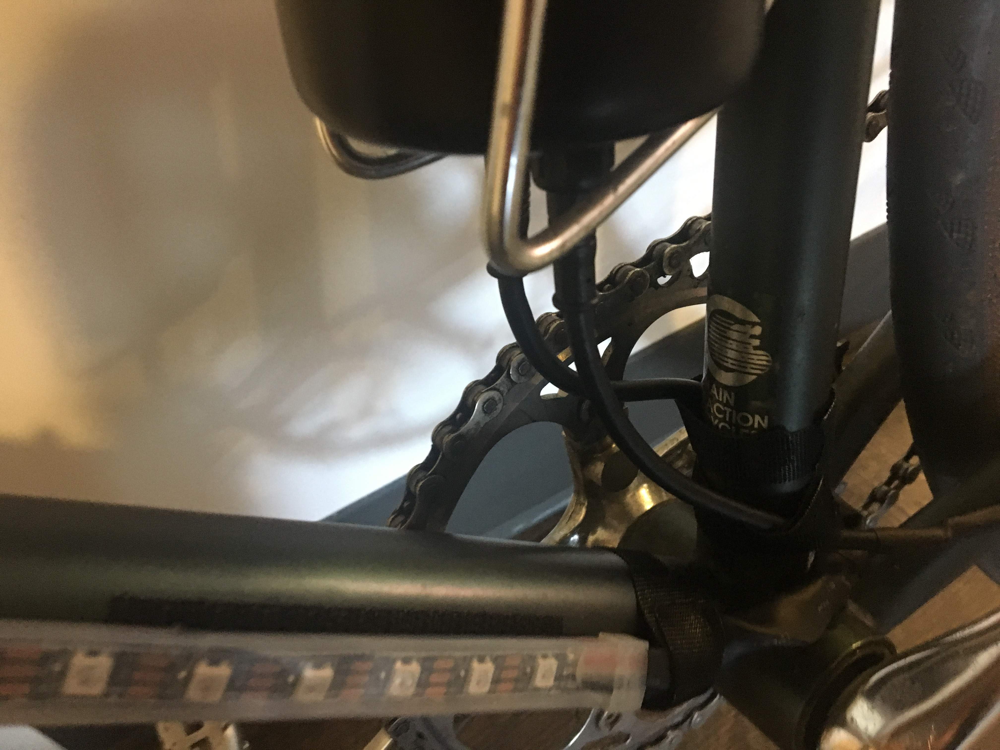

## Speed-sensitive bike lights

This is a project I did to create side-mounted lights for my commuter bike that would react to different speeds.

You can see them in action in the short video below!

## Hardware Design

An LED light strip covers both sides of the bike, going up the downtube (the bottom part of the frame), around the front of the headtube (the front part of the frame above the wheel), and back down the downtube on the other side.

The computer (an Arduino Uno) and battery sit inside a re-purposed water bottle container attached to the seat tube (the middle part of the frame). A [Hall sensor chip](https://en.wikipedia.org/wiki/Hall_effect_sensor) installed on one of the seat stays (the back lower part of the frame) records whenever a magnet attached to one of the spokes passes by. The computer uses this data to measure speed, so it can determine what to display on the light strip.

I also wanted to be able to easily detach the whole system from my bike, in about 5 minutes or less. The light strip and sensor cabling can detach from the power/computer container, and the whole system is secured with velcro to the frame. I've been able to take it on and off, and even stick it in a backpack, without too much trouble.

Battery life is quite long.
From the numbers [here](https://learn.adafruit.com/battery-power-for-led-pixels-and-strips/estimating-running-time), each "pixel" of 3 LEDs has a max power consumption of 60 mAh.
I guessed the battery pack had approximately 3000-4000 mAh based on https://en.wikipedia.org/wiki/AA_battery#Rechargeable_cells.
Eight pixels are on at a time, so even if they were running at max brightness, I would expect something in the range of 5-7 hours battery life, taking extra power needed for the other components into account.
The pixels are typically nowhere near the max brightness, so this might even be a low estimate.
Empirically, I've been able to leave it on for hours at a time with no visible effect on LED brightness.

The battery capacity is far more than I need. If I were to make another iteration, I would look at 3d printing the case and select a smaller form factor for the computer and power supply.
I would also rethink the placement of the cables, the velcro system (would be nice not to have to glue velcro to the frame), and the minimal protection from the elements.

## Software Design

I kept this project simple, with less than 300 lines of code.
However, I have plans to experiment with external graphical interfaces to simulate and update the system, which would make it a lot more complex.

The Arduino Uno is a single-threaded, single core computing platform that just runs the code you provide in a tight loop over and over.
This posed a challenge for simultaneously keeping track of the speed and updating the light strip.
Although the Arduino Uno does not have genuine threads, you can use a number of pseudo-threading libraries (I used [ArduinoThread](https://github.com/ivanseidel/ArduinoThread)). These give the appearance of multi-tasking by only executing the work given to the thread at a set interval, and doing a no-op any other time the thread is called. If you have 2+ tasks that don't have to run on every loop and they do fairly lightweight work, then setting them to run at different intervals, faster than a human would typically notice, can give the appearance of simultaneity.

Updating the light strip and keeping track of the speed fit this use case well. The light strip is idle most of the time except during transition, and it isn't crucial that we calculate the speed at every millisecond. I implemented two pseudo-threads running callbacks on separate time intervals: A light strip updating thread, and a speed updating thread. I discovered it was important to execute the actual sensor reads in every loop, because it is easy to miss a read at high speed. So, that action occurs outside of the thread context in loop().

I also wanted the speed data to inform the frequency of the light strip update operation. This turned out to be fairly simple: The light strip thread gets the latest speed from the speed thread, and then updates its own callback frequency based on this data.

Lastly, I had fun working out different ways to change the lightstrip along color gradients. I ended up settling on a linear gradient to move between RGB values, but I'm sure there are all kinds of other interesting algorithms to explore (maybe I should study some color theory!).

## Parts

- 1 Arduino Uno
- 1 4AA battery holder (https://www.amazon.com/LAMPVPATH-Battery-Connector-Plastic-Housing/dp/B01MAXT00Q/)
- 4 rechargable AA batteries. Note: The rechargable part is important! Alkaline batteries will have a higher voltage. 4AA rechargable is ~4.8V, close enough to 5V to power the whole system without issue. 4AA alkaline is ~6V, above the safe voltage for the light strip.
- 1 toggle switch (https://www.adafruit.com/product/3308)
- 1 Hall sensor chip (https://www.amazon.com/SunFounder-Switch-Sensor-Arduino-Raspberry/dp/B013G5N03O/)
- 1 spoke magnet (https://www.amazon.com/CatEye-Universal-Wheel-Magnet/dp/B018RZ23AE/)
- 1 470-ohm resistor
- 1 large capacitor (I used the 4700uF model found here: https://www.adafruit.com/product/1589)
- 1 Neopixel light strip, 60 pixels per strip (https://www.adafruit.com/product/1461?length=1)
- 2 4-wire waterproof cables (https://www.adafruit.com/product/744)
- 1 mid-size water bottle storage container (or even just a water bottle). Main limiting factor here is whether the Arduino can fit through the mouth of the bottle. I used the WBS Unit from Profile Design, it was just barely big enough to fit everything (https://www.amazon.com/Profile-Designs-Water-Bottle-Storage/dp/B01E6EZNW0/).
- Adhesive velcro strips, and some velcro ties
- Some sticky pads for wall hangings (relevant for padding the sensor if you need to get it closer to the wheel)
- Lots of colored hook up wire, shrink wrap, superglue, etc.

## Wiring Diagram

## How to make it

1. I wired up and got the whole system working without trying to put anything other than the light strip on the bike. Only after I was satisfied that the code/hardware actually worked, did I think about how it was going to get attached.
1. Then, I took the water bottle storage container and drilled 3 holes - one just above where the cage would end for the toggle switch, and two in the bottom of the container (for cables for the light strip and the Hall sensor).
1. Then, I broke out the soldering iron and started with where the 4 wire cables would end: at the light strip and at the sensor.
      - Soldered the 4 wires to power, data, ground, and ground wires from the LED strip. I lost the threaded connector for the cable during this process.
      - For the other one, cut off one wire and soldered the remaining to power, data, and ground wires of the Hall sensor.
1. Then, I started from the other end and connected the power supply to the toggle switch, and soldered wires going into and out of the switch.
1. At this point I really wanted to be sure that everything was right, because once I soldered any of the 7 wires from the cables to the Arduino or output of the switch, I wouldn't be able to dissasemble anything without de-soldering most of it.
1. After making sure, I soldered all the remaining connections, which was a bit tricky since everything was half in the container. Since the power/ground wires going to the Arduino were so close, I put some glue in between them after soldering the wires to the header pins, as insulation.
1. Then I attempted to stuff everything into the storage container. It took some wrangling, but the container was just barely large enough to fit everything. I'd originally planned to somehow mount the Arduino and battery pack in there to prevent rattling around, but they fit pretty snugly anyhow. The battery pack is easy to remove for recharging, and the USB port on the Arduino is easily accessible for reprogramming.
1. Finally, I worked on mounting the sensor to the back left chainstay, near the wheel. I used a small piece of an adhesive velcro strip to attach it, and found that I needed to put some padding on the back of the sensor to get it close enough to the wheel. Using adhesive wall hanging strips added about 10-20 millimeters, more than enough. I forgot to put a cover over the sensor before attaching the Velcro, so it is exposed to the elements (and I will probably need to replace it). Strategically placed velcro ties keep all the cables from straying too far from the frame.

## More Pictures and Videos

